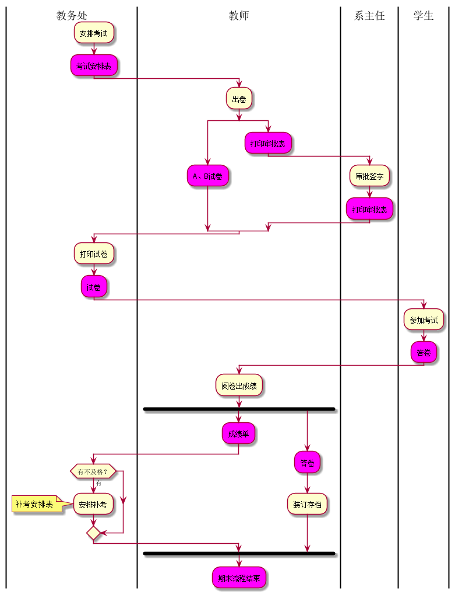
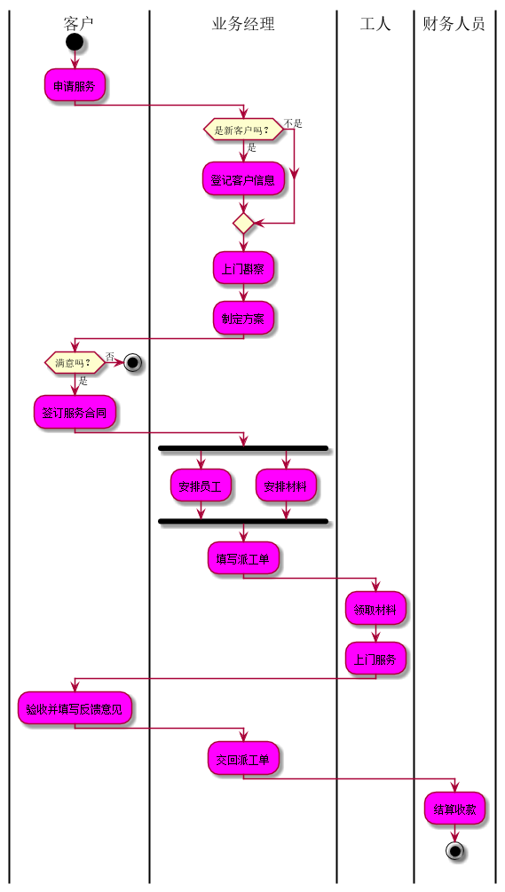

# 实验1：业务流程建模

|学号|班级|姓名|照片|
|:-------:|:-------------: | :----------:|:---:|
|201510414427|软件(本)15-4|张启恒||

## 流程图1：考试及成绩管理流程

**PlantUML源码如下：**

``` experiment1-flow1
@startuml

|教务处|
:安排考试;
#FF00FF:考试安排表;
|教师|
:出卷;
split
#FF00FF:A、B试卷;
split again
#FF00FF:打印审批表;
|系主任|
:审批签字;
#FF00FF:打印审批表;
|教务处|
end split
:打印试卷;
#FF00FF:试卷;
|学生|
:参加考试;
#FF00FF:答卷;
|教师|
:阅卷出成绩;
fork
#FF00FF:成绩单;
|教务处|
if (有不及格？) then (有)
:安排补考;
note left
补考安排表
end note
endif
|教师|
fork again
#FF00FF:答卷;
:装订存档;
end fork
#FF00FF:期末流程结束;

@enduml
```

**业务流程图如下：**



**流程说明：**

考试及成绩管理流程 - 整个流程图按照不同的用户类别分为四行，用|object|区分各功能的使用者。|教务处|负责安排全校课程的考试安排；|教师|负责准备好A、B试卷， 填写"试卷打印审批表"一并交给|系主任|审批签字，将选中的期末试卷和已签字的试卷打印审批表交与|教务处|印刷部门进行印刷；|学生|按时到达指定考场进行考试，考试完毕后教师进行阅卷，产出成绩单，并对|学生|答卷装订存档，若课程有有不及格情况，|教务处|负责安排补考时间和地 点，产生补考安排表，流程结束。


## 流程图2： 客户维修服务流程

**PlantUML源码如下：**

``` experiment1-flow2
@startuml

|客户|
start
#FF00FF:申请服务;
|业务经理|
if(是新客户吗？) then (是)
#FF00FF:登记客户信息;
else(不是)
endif
#FF00FF:上门斟察;
#FF00FF:制定方案;
|客户|
if(满意吗？) then (否)
stop
else(是)
#FF00FF:签订服务合同;
|业务经理|
fork
#FF00FF:安排员工;
fork again
#FF00FF:安排材料;
end fork
#FF00FF:填写派工单;
|工人|
#FF00FF:领取材料;
#FF00FF:上门服务;
|客户|
#FF00FF:验收并填写反馈意见;
|业务经理|
#FF00FF:交回派工单;
|财务人员|
#FF00FF:结算收款;
stop

@enduml
```

**业务流程图如下：**



**流程说明：**

客户维修服务流程 - 业务流程从客户申请服务开始。如果是新用户，业务经理将该客户的基本信息记录下来。接下来业务经理将上门勘察，并制定具体维修方案。业务经理和客户进行沟通，如果达成一致，则签订正式服务合同，否则流程终结。根据合同方案，业务经理将对实施维修的人员和所需的材料进行计划，并填发派工单。工人拿到派工单后，领取指定材料上门服务。服务完成后客户进行验收，并在派工单上填写维修信息和反馈意见。业务经理收回派工单后，通知财务人员进行项目的结算并收款，流程结束。

**问题：**

1.图6.1按不同的使用者（用户类别）分成了4行，图6.2按不同的用户类别分成了4列， 如何在建模中区分各功能的使用者？

2.图6.1中有同步功能“A、B试卷”和“打印审批表”等，图6.2也有同步功能“安排工人”和“安排材料”，如何在建模中绘制？

**答：在plantuml建模中使用 |object| 区分各个功能的使用者，同步是使用关键字fork，fork again和end fork表示并行处理。**

