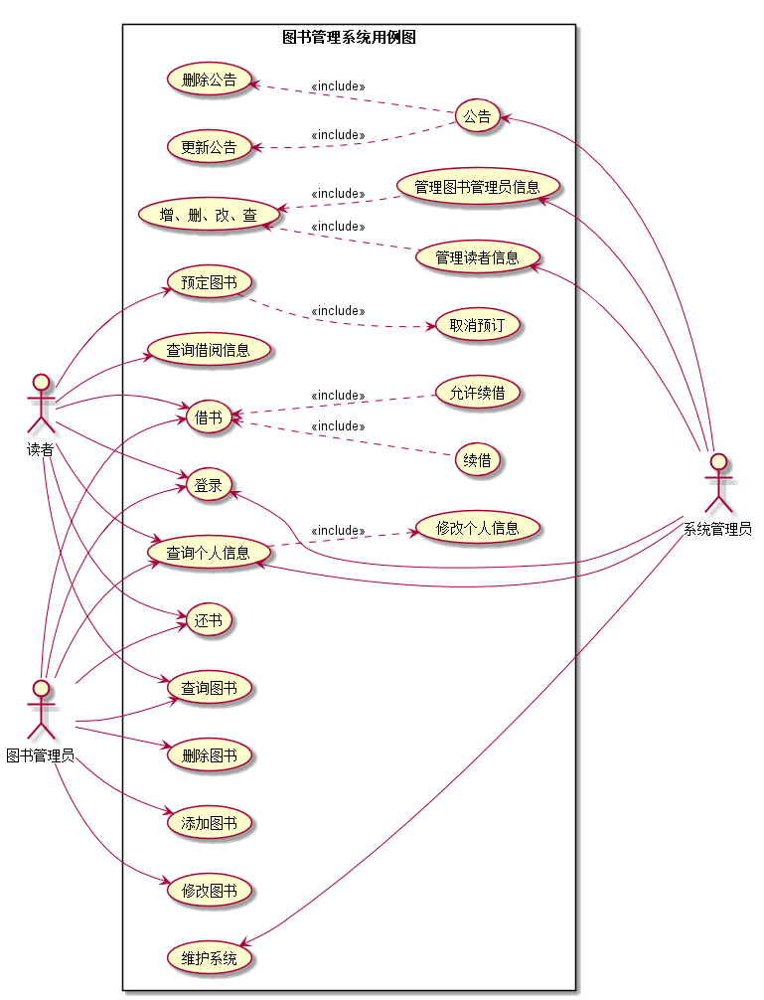
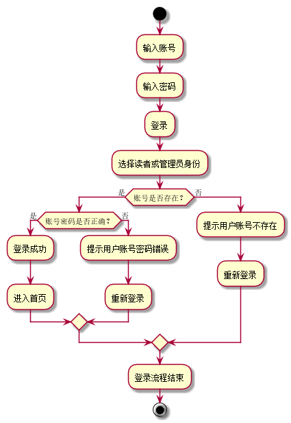
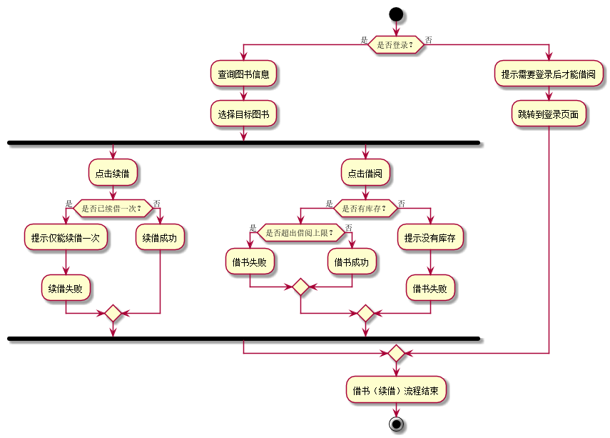

# 实验二：图书管理系统用例建模
|学号|班级|姓名|照片|
|:-------:|:-------------: | :----------:|:---:|
|201510414427|软件(本)15-4|张启恒||

## 1.图书管理系统的用例关系图
### 1.1用例图PlantUML源码如下：
<pre>
@startuml

left to right direction
skinparam packageStyle rectangle
actor 读者 as reader
actor 图书管理员 as bm
actor 系统管理员 as sm
rectangle 图书管理系统用例图{

    bm --> (登录)
    bm --> (查询个人信息)
    (查询个人信息) ..> (修改个人信息) :<<include>>
    bm --> (查询图书)
    bm --> (添加图书)
    bm --> (修改图书)
    bm --> (删除图书)
    bm --> (还书)
    bm --> (借书)
    (借书)<..(允许续借):<<include>>

    reader --> (登录)
    reader --> (查询个人信息)
    reader --> (查询图书)
    reader --> (查询借阅信息)
    reader --> (预定图书)
    (预定图书)..>(取消预订):<<include>>
    reader --> (借书)
    (借书)<..(续借):<<include>>
    reader --> (还书)

    (登录) <-- sm
    (查询个人信息) <-- sm
    (公告) <-- sm
    (更新公告) <..(公告) :<<include>>
    (删除公告) <..(公告) :<<include>>
    (管理图书管理员信息) <-- sm
    (增、删、改、查)<.. (管理图书管理员信息) :<<include>>
    (管理读者信息) <-- sm
    (增、删、改、查)<.. (管理读者信息) :<<include>>
    (维护系统) <---- sm
}

@enduml

</pre>

### 1.2用例图如下：

## 2.参与者说明

### 2.1系统管理员
主要职责： 
（1）图书管理员信息的增删改查； 
（2）读者信息的增删改查； 
（3）定期维护图书管理系统，保证运行无误； 
（4）发布公告等重要通知。 

### 2.2图书管理员
主要职责： 
（1）能熟练使用图书管理系统，具有一定的事务分辨和处理能力； 
（2）具有完善的图书登记，包括读者借出图书时间，归还时间，是否超时罚款以及其他的特殊情况，提高图书流通率； 
（3）按要求、有计划、有目的的选购图书，并及时及时添购新书籍； 
（4）添加，修改以及删除图书信息； 
（5）做好图书馆的安全防护工作、清洁工作、秩序工作等。 

### 2.3读者
主要职责： 
（1）图书借阅后，应该及时归还。 
（2）借阅到的图书应该小心保护，不要损坏。 
（3）图书馆图书不能外借，自己借自己用，养成良好习惯。 
（4）图书遗失后，要主动罚款购买，不要逃避责任。 

## 3.用例规约表
### 3.1 “登录”用例规约

|**用例名称**|登录|
|:-:|:-:|
|**参与者**|读者，图书管理员，系统管理员|
|**前置条件**|参与者已经拥有账号|
|**后置条件**|成功登录|
|**主事件流**||
|**参与者动作**|**系统行为**|
|1.参与者输入账号密码点击登录 3.账号正确，登录成功 5.用户进行进一步操作|2.系统验证账号密码是否正确 4.系统根据角色权限跳转到对应首页 6.登录成功，流程结束|
|**备选事件流**||
|**1a**.参与者们忘记了登录密码 1.读者直接通过系统重置，管理员需要联系上层 **2a**.系统出错 1.参与者等待服务器恢复正常，或系统管理员维护||
|**业务规则**||
|1、读者没有注册功能、有系统系统管理员分配 2、图书管理员由系统管理员分配 3、系统管理员由系统开发者分配|

**“登录”用例流程图源码如下：**
<pre>
    @startuml
    start
    :输入账号;
    :输入密码;
    :登录;
    :选择读者或管理员身份;
    if(账号是否存在？) then(是)
        if(账号密码是否正确？) then(是)
            :登录成功;
            :进入首页;
         else(否)
            :提示用户账号密码错误;
            :重新登录;
         endif;
    else(否)
        :提示用户账号不存在;
        :重新登录;
    endif;
    :登录流程结束;
    stop;
    @enduml
</pre>

**“登录”用例流程图如下：**
 

###     3.2 “查询图书信息”用例规约

|用例名称|查询图书信息|
|:-:|:-:|
|**参与者**|读者（主要参与者）、图书管理员（主要参与者）|
|**前置条件**|参与者登录到系统|
|**后置条件**|查询图书信息成功|
|**主事件流**||
|**参与者动作**|**系统行为**|
|1.读者或图书管理员点击查看图书信息 3.用户点击下一页 5.查看成功|2.系统获取图书信息并显示 4.系统获取下一页信息并显示 6.操作成功，流程结束|
|**备选事件流**||
|**1a**、用户没有登录到系统 &nbsp;&nbsp;&nbsp;&nbsp;1.系统提示用户需要先登录系统 **2a**、用户过快的点击下一页操作 &nbsp;&nbsp;&nbsp;&nbsp;1.一切情况按系统显示为准||
|**业务规则**||
|1、本系统需要先登录才能查看图书信息 2、读者和管理员权限不同，显示的内容随之改变|

### 3.3“借书和续借”用例规约

|**用例名称**|借书和续借|
|:-:|:-:|
|**参与者**|读者（主要参与者）、图书管理员（主要参与者）|
|**前置条件**|参与者登录到系统|
|**后置条件**|读者借阅到图书、图书管理员更新记录|
|**主事件流**||
|**参与者动作**|**系统行为**|
|1.读者查阅所有的图书信息 3.读者选择目标书籍，并点击借阅（续借） 5.图书管理员允许借阅（续借）图书|2.系统显示图书信息 4.系统验证该用户是否能借阅（续借）图书 6.借阅成功，向数据库录入数据|
|**备选事件流**||
|**1a**、该读者没有借阅权限（可能是借阅数 量超过上限，或者是存在恶意借书不还情况） &nbsp;&nbsp;&nbsp;&nbsp;1.系统提示没有借阅权限 **2a**、图书管理员没有点击确认 &nbsp;&nbsp;&nbsp;&nbsp;1.等待，直到点击确认为止 **3a**、图书已经被预定 &nbsp;&nbsp;&nbsp;&nbsp;1.系统提示该图书不能被借阅||
|**业务规则**||
|1、一个读者最多只能同时借阅5本书 2、一个读者同时只能预定3本书 3、借阅图书时间默认一个月，续借时间同上， 每本书最多被续借一次|

**“借书和续借”用例流程图源码如下：**
<pre>
    @startuml
    start;
    if(是否登录？) then(是)
        :查询图书信息;
        :选择目标图书;
        fork
        :点击续借;
        if(是否已续借一次？) then(是)
            :提示仅能续借一次;
            :续借失败;
        else(否)
            :续借成功;
        endif;
        fork again
        :点击借阅;
        if(是否有库存？) then(是)
            if(是否超出借阅上限？) then(是)
                :借书失败;
             else(否)
                :借书成功;
            endif;
        else(否)
            :提示没有库存;
            :借书失败;
        endif;
        endfork;
    else(否)
        :提示需要登录后才能借阅;
        :跳转到登录页面;
    endif;
    :借书（续借）流程结束;
    stop;
    @enduml
</pre>

**“借书和续借”用例流程图如下：**
 

###     3.5 “修改个人信息”用例规约

|用例名称|修改个人信息|
|:-:|:-:|
|**参与者**|读者、图书管理员、系统管理员|
|**前置条件**|参与者登录到系统|
|**后置条件**|修改个人信息成功、更新数据|
|**主事件流**||
|**参与者动作**|**系统行为**|
|1.参与者点击“个人信息”按钮 3.参与者选中需要修改的信息，修改后提交 5.修改信息完成，退出系统|2.系统跳转到个人信息页面 4.该个人新信息录入数据库 6.退出系统成功，流程完成|
|**备选事件流**||
|**1a**.参与者尝试修改不被允许修改的信息 &nbsp;&nbsp;&nbsp;&nbsp;1.系统提示该信息不允许被修改 **2a**.参与者提交不被允许的特殊格式字符 &nbsp;&nbsp;&nbsp;&nbsp;1.系统提示格式错误 **3a**.参与者修改后未提交就退出系统 &nbsp;&nbsp;&nbsp;&nbsp;1.系统忽略本次操作||
|**业务规则**||
|1.只能修改允许修改的字段信息 2.一定时间内仅能修改一次信息，避免恶意修改，增加服务器压力 3.某些信息仅能修改指定次数，用完后则不再能修改|

### 3.6“增删改图书”用例规约

|用例名称|增删改图书信息|
|:-:|:-:|
|**参与者**|系统管理员，图书管理员|
|**前置条件**|系统管理员和图书管理员均登录到系统|
|**后置条件**|图书信息修改成功|
|**主事件流**||
|**参与者动作**|**系统行为**|
|1.若是添加图书，则直接录入图书信息 3.用户点击查询图书信息 5.用户点击修改或删除图书|2.系统存储图书信息后显示操作成功 4.系统显示图书信息（包括新增的图书） 6.系统修改对应图书信息，提示操作成功 7.增删改图书成功，流程结束|
|**备选事件流**||
|**1a**、修改过成功意外退出系统，信息仅成功录入一半 &nbsp;&nbsp;&nbsp;&nbsp;1.系统删除新增内容，并在日志文档中记录 **2a**、用户删除图书后想还原信息 &nbsp;&nbsp;&nbsp;&nbsp;1.2小时以内进行的操作都允许被重置 **3a**、用户恶意的进行信息更改 &nbsp;&nbsp;&nbsp;&nbsp;1.系统进行的所有更改操作都需要3个以上的管理员确认后方可生效||
|**业务规则**||
|1,图书管理员的操作需要被确认 2,在一定时间内进行的操作不能过多 
