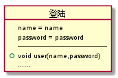
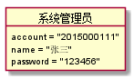

# 实验三：图书管理系统领域对象建模
|学号|班级|姓名|照片|
|:-------:|:-------------: | :----------:|:---:|
|201510414427|软件(本)15-4|张启恒||

## 1.图书管理系统的类图
### 1.1 类图PlantUML源码如下：

<pre>
@startuml

class 管理员 {
    ID
    管理员名
    密码
    角色
    电话
    照片
    --set和get--
    ...
    --
    End of class
}

class 图书管理员 {
    角色
    --
    End of class
}
class 系统管理员{
    角色
    --
    End of class
}

class 读者 {
    账号
    姓名
    密码
    性别
    出生日期
    角色
    所属学院
    专业
    借书数量
    照片
    电话
    --set和get--
    ...
    --
    End of class
}

class 馆藏目录{
    ID
    ISBN
    书名
    语言
    国家
    种类
    种类细分
    其它
    --get And set--
    ...
    --
    End of class
}
class 图书{
    ISBN
    书名
    出版社
    作者
    价格
    馆藏数量
    可借数量
    借出总次数
    内容简介
    照片
    --set和get--
    ...
    --
    End of class
}

class 借书记录{
    流水号
    ISBN
    读者ID
    书名
    借书日期
    归还日期
    是否续借
    借书时长
    是否归还
    是否逾期
    逾期时长
    --set和get--
    ...
    --
    End of class
}

class 预定记录{
    流水号
    读者ID
    ISBN
    预定日期
    时长
    是否取消预定
    --set和get--
    ...
    --
    End of class
}

class 逾期记录{
    流水号
    ISBN
    读者ID
    书名
    逾期时间
    归还时间
    逾期时长
    备注
    --set和get--
    ...
    --
    End of class
}

class 图书操作日志{
    ID
    动作
    细节
    创建时间
    实体ID
    实体名称
    --set和get--
    ...
    --
    End of class
}

class 公告{
    ID
    公告内容
    开始时间
    结束时间
    备注
    --set和get--
    ...
    --
    End of class
}

管理员 <- 系统管理员
管理员 <- 图书管理员

系统管理员 "1"-- "1..10"图书管理员 :Association
系统管理员 "1"- "n"读者 :Association
系统管理员 "1"*- "n"公告 :Association

图书管理员 "1"-- "n"图书 :Association
图书管理员 "1"-- "n"图书操作日志 :Association

馆藏目录 "1"<- "n"图书 :Contains

图书 "1"--  "n"预定记录 :Association
图书 "1"-- "n"借书记录 :Association
图书 "1"-- "n" "图书操作日志" :Association
图书 "1"-- "0..2"逾期记录 :Contains

读者 "1"--"n"预定记录 :Contains
读者 "1"-- "n"借书记录 :Contains
读者 "1"-- "0..2"逾期记录 :Contains

@endum
</pre>

### 1.2 类图如下：

### 1.3 类图说明：
本类图参考实验二图书管理系统用例，主要包含9个类，管理员、馆藏目录、读者、预定记录、借书记录、还书、公告、逾期记录、图书。其中系统管理员类，主要方法有系统维护、账号管理（增删改查）、权限管理、公告更新与删除； 图书管理员类，由维护图书用例产生，图书增删改查、图书预定管理、借书登记、还书登记、个人信息修改；读者类，由维护读者信息用例产生，被维护读者信息、图书归还、预定图书、查看图书、查询借阅情况、取消预定等。

## 2 图书管理系统的对象图
### 2.1 图书管理系统类图局部对象图
源码如下：
<pre>
startuml

object 登陆{
    name = name
    password = password
    —————————————
    + void user(name,password)
    ......
}

object 读者{
    account = 201510514427
    姓名 = 张启恒
    年龄 = 21
    身份证号 = 1234567890213134
    借书次数 = 10
    借书记录
    预定图书
    ......
}

object 图书管理员{
    account = "201512340000"
    name = "李四"
    password = "123456"
    ......
}

object 系统管理员{
    account = "2015000111"
    name = "张三"
    password = "123456"
    ......
}

object 图书{
    ISBN = 98984284529339
    书名 = 十万个为什么
    出版社 = 清华大学出版社
    作者 = 余小小
    价格 = 99.00
    可借数量 = 50
    ......
}

object 馆藏目录{
    书目列表 ：《十万个为什么》
    ......
 }

object 借书记录{
    借书日期 = 2018-01-02
    应还日期 = 2018-03-01
    还书日期 = 2018-02-24
    借书次数 = 20
    ......
}

object 预定记录{
    预定日期：2018-01-01
    状态：可借
    截至日期：2018-01-07
    ......
}

object 逾期记录{
    逾期状态：是
    逾期时间：2018-05-01
    逾期天数：30
    ......
}

object 还书{
    ISBN = 98984284529339
    书名 = 十万个为什么
    还书时间 = 2018-02-24
    状态 = 已还
    ......
}

object 公告{
    标题 = 新书上架
    内容 = 图书馆将于2018-05-01上架30余款新书，其中有15本美国原著大作、国内精选论文、计算机类等新书。敬请广大师生借阅。
    时间 = 2018-03-23
    ......
}

读者 --> 登陆
图书管理员 ---> 登陆
系统管理员 ---> 登陆

系统管理员 --> 公告 :公告更新、删除
系统管理员 --> 图书管理员 :账号管理、权限分配
系统管理员 --> 读者 :账号管理（增删查改）

图书管理员 -- 图书 :图书管理（增删查改）
图书管理员 <-- 借书记录 :登记借书记录
图书管理员 <-- 还书 :删除借书记录
图书管理员 -- 预定记录 :查看预定记录

馆藏目录 ---> 图书
图书 -->  预定记录 :系统自动判断读者是否可借书
图书 --> 借书记录 :可查询图书借阅记录

读者 --> 预定记录 :预定图书、查询记录
读者 --> 借书记录 :查询借书记录
读者 --> 还书 :归还图书

借书记录 --> 逾期记录 :系统判断是否逾期

@endum
</pre>
对象图如下： 

### 2.2 类“登陆”的对象图
源码如下：
<pre>
@@startuml
 object 登陆{
     name = name
     password = password
     —————————————
     + void user(name,password)
     ......
 }
 @enduml
</pre>
对象图如下： 

### 2.3 类“系统管理员”的对象图如下
源码如下：
<pre>
@startuml
object 系统管理员{
    account = "2015000111"
    name = "张三"
    password = "123456"
}
@enduml
</pre>
对象图如下： 

### 2.4 类“图书管理员”的对象图如下
源码如下：
<pre>
@startuml

object 图书管理员{
    account = "201512340000"
    name = "李四"
    password = "123456"
}

@enduml
</pre>
对象图如下： 

### 2.5 类“读者”的对象图如下
源码如下：
<pre>
@startuml

object 读者{
    账号 = 201510514427
    姓名 = 张启恒
    年龄 = 21
    身份证号 = 1234567890213134
    借书次数 = 10
    借书记录
    预定图书
    ......
}

@enduml
</pre>
对象图如下： 

### 2.6 类“图书”的对象图如下
源码如下：
<pre>
@startuml

object 图书{
    ISBN = 98984284529339
    书名 = 十万个为什么
    出版社 = 清华大学出版社
    作者 = 余小小
    价格 = 99.00
    可借数量 = 50
    ......
}

@enduml
</pre>
对象图如下： 

### 2.7 类“馆藏书目”的对象图如下
源码如下：
<pre>
@startuml

object 馆藏目录{
    书目列表 ：《十万个为什么》
    ......
 }

@enduml
</pre>
对象图如下： 

### 2.8 类“借书记录”的对象图如下
源码如下：
<pre>
@startuml

object 借书记录{
    借书日期 = 2018-01-02
    应还日期 = 2018-03-01
    还书日期 = 2018-02-24
}

@enduml
</pre>
对象图如下： 

### 2.9 类“预定记录”的对象图如下
源码如下：
<pre>
@startuml

object 预定记录{
    预定日期：2018-01-01
    状态：可借
    截至日期：2018-01-07
}

@enduml
</pre>
对象图如下： 

### 2.10 类“逾期记录”的对象图如下
源码如下：
<pre>
@startuml

object 逾期记录{
    逾期状态：是
    逾期时间：2018-05-01
    逾期天数：30
    ......
}

@enduml
</pre>
对象图如下： 

### 2.11 类“还书”的对象图如下
源码如下：
<pre>
@startuml

object 还书{
    ISBN = 98984284529339
    书名 = 十万个为什么
    还书时间 = 2018-02-24
    状态 = 以还
}

@enduml
</pre>
对象图如下： 

### 2.12 类“公告”的对象图如下
源码如下：
<pre>
@startuml

object 公告{
    标题 = 新书上架
    内容 = 图书馆将于2018-05-01上架30余款新书，其中有15本美国原著大作、国内精选论文、计算机类等新书。敬请广大师生借阅。
    时间 = 2018-03-23
    ......
}

@enduml
</pre>
对象图如下： 

