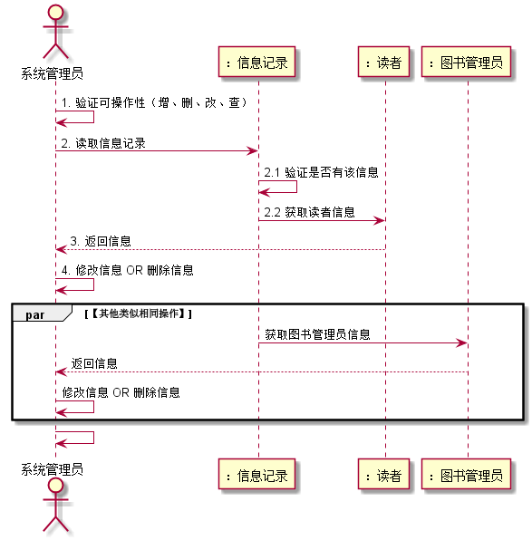
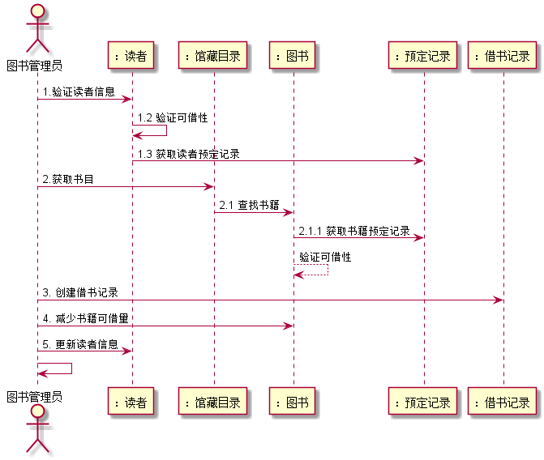
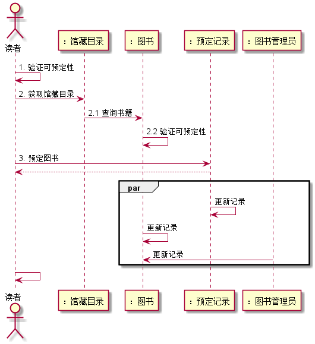
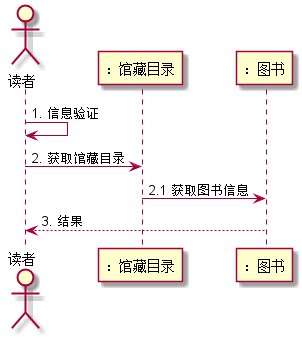
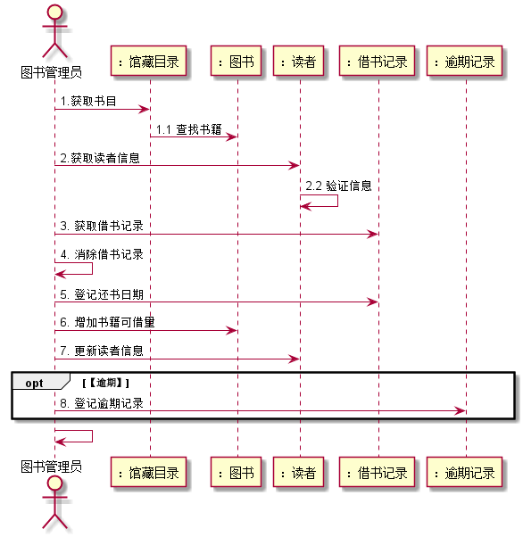
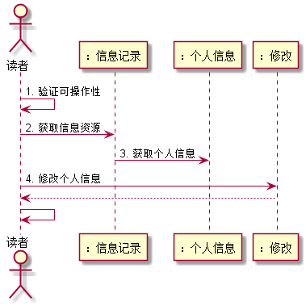

# 实验四：图书管理系统顺序图绘制
|学号|班级|姓名|照片|
|:-------:|:-------------: | :----------:|:---:|
|201510414427|软件(本)15-4|张启恒||

## 图书管理系统主要用例如下：

## 1.系统管理员修改公告用例
### 1.1 PlantUML源码
<pre>
@startuml

actor "：系统管理员" as bm
participant "：信息记录" as re
participant "：公告" as a
participant "：修改" as update

bm -> bm: 1. 验证可操作性
bm -> re: 2. 获取资源信息
re -> a: 2.1 获取公告信息
bm -> update: 2.1.1. 修改公告信息
bm <-- update: 结果
bm <- bm

@enduml
</pre>
### 1.2 顺序图如下 

### 1.3 用例说明
系统管理员验证可操作信息，获取系统中信息记录中所记录的具体公告信息，系统管理员在通过修改对象对公告进行更改，修改对象返回操作结果，用例结束。

## 2.系统管理员增删改查用例
### 2.1 PlantUML源码
<pre>
@startuml

actor 系统管理员 as SM
participant "：信息记录" as re
participant "：读者" as read
participant "：图书管理员" as BM
participant "： 增加" as save
participant "：修改" as update
participant "：删除" as delete

SM <- SM: 1. 验证可操作性（增、删、改、查）
SM -> re: 2. 读取信息记录
re <- re: 2.1 验证是否有该信息
re -> read: 2.2 获取读者信息
SM -> update: 3. 修改读者信息
SM <-- update: 返回结果

par 【其他类似相同操作】
SM -> save: 增加读者
SM -> delete: 删除读者信息

re<- re: 验证是否有改信息
re -> BM: 获取图书管理员信息
SM -> update: 修改图书管理员信息
SM -> save: 增加图书管理员
SM -> delete: 删除读者信息
end
SM -> SM
@enduml
</pre>

### 2.2 顺序图如下 

### 2.3 用例说明

系统管理员首先验证自己的可操作性，然后读取系统信息记录中心所记录的信息，获取到该具体信息后，系统管理员通过修改对象对信息进行修改，修改对象返回执行结果，信息自动更新，用例结束。（增删改查用例操作类似，不在一一列出）

## 3. 借书用例
### 3.1 PlantUML源码
<pre>
@startuml

actor 图书管理员 as bm
participant "：读者" as read
participant "：馆藏目录" as tools
participant "：图书" as book
participant "：预定记录" as order
participant "：借书记录" as ji

bm -> read: 1.验证读者信息
read -> read: 1.2 验证可借性
read -> order: 1.3 获取读者预定记录
bm -> tools: 2.获取书目
tools -> book: 2.1 查找书籍
book -> order: 2.1.1 获取书籍预定记录
book --> book: 验证可借性
bm -> ji: 3. 创建借书记录
bm -> book: 4. 减少书籍可借量
bm -> read: 5. 更新读者信息
bm -> bm

@enduml
</pre>

### 3.2 用例图如下 

### 3.3 用例说明
读者借书用例实现，图书管理员首先验证读者信息，对象读者判断读者借书记录验证可借性，在判断读者是否有过预定记录，如果可以借书，图书管理员通过对象馆藏目录获取到具体的图书，系统管理员创建借书记录，对象图书更新减少书记可借数量，同时对象读者更新读者信息，返回结果，用例结束。

## 4 预定图书用例
### 4.1 PlantUML源码
<pre>
@startuml

actor 读者 as read

participant "：馆藏目录" as tools
participant "：图书" as book
participant "：预定记录" as order
participant "：图书管理员" as bm

read -> read: 1. 验证可预定性
read -> tools: 2. 获取馆藏目录
tools -> book: 2.1 查询书籍
book -> book: 2.2 验证可预定性
read -> order: 3. 预定图书
read <-- order

par
order <- order: 更新记录
book <- book :更新记录
book <- bm: 更新记录
end
read <- read
@enduml
</pre>

### 4.2 用例图如下 

### 4.3 用例说明
读者预定图书用例实现，首先验证读者的可借性，通过对象馆藏目录获取图书信息，对象图书验证可预定性，读者通过对象预定记录创建预定记录，同时对象预定记录和对象图书更新记录用例结束。

## 5 查询图书信息用例
### 5.1 PlantUML源码
<pre>
@startuml

actor "读者" as reader

participant "：馆藏目录" as tools
participant "：图书" as book

reader <- reader: 1. 信息验证
reader -> tools:  2. 获取馆藏目录
tools -> book: 2.1 获取图书信息
reader <-- book: 3. 结果

@enduml
</pre>

### 5.2 用例图如下 

### 5.3 用例说明
读者查询图书用例实现，读者首先验证自己的信息，通过对象馆藏目录获取图书信息，对象图书返回结果，用例结束。

## 6 归还图书用例
### 6.1 PlantUML源码
<pre>
@startuml

actor 图书管理员 as bm
participant "：馆藏目录" as tools
participant "：图书" as book
participant "：读者" as read
participant "：借书记录" as ji
participant "：逾期记录" as yu

bm -> tools: 1.获取书目
tools -> book: 1.1 查找书籍
bm -> read: 2.获取读者信息
read -> read: 2.2 验证信息
bm -> ji: 3. 获取借书记录
bm <- bm: 4. 消除借书记录
bm -> ji: 5. 登记还书日期
bm -> book: 6. 增加书籍可借量
bm -> read: 7. 更新读者信息
opt 【逾期】
bm -> yu: 8. 登记逾期记录
end
bm -> bm

@enduml
</pre>

### 6.2 用例图如下

### 6.3 用例说明
读者归还图书用例实现，图书管理员验证可操作性，通过对象馆藏目录获取图书具体信息，如果找到了该图书，则正常归还，通过对象读者获取读者信息并验证，通过对象结束记录获取记录信息，图书管理员消除借书记录，登记还书日期，通过对象图书更新书籍可借量，更新读者信息，如果图书到期未归还，则触发对象逾期记录登记逾期信息，并作出相应的处理，用例结束。

## 7 修改信息用例
### 7.1 PlantUML源码
<pre>
@startuml

actor "读者" as reader
participant "：信息记录" as re
participant "：个人信息" as info
participant "：修改" as update

reader <- reader : 1. 验证可操作性
reader -> re : 2. 获取信息资源
re -> info : 3. 获取个人信息
reader -> update: 4. 修改个人信息
update --> reader

reader <- reader

@enduml
</pre>

### 7.2 用例图如下 

### 7.3 用例说明
读者修改个人信息用例实现，读者首先验证可操作性，通过对象信息记录获取系统信息资源，通过对象信息记录获取到个人具体信息，通过对象修改修改个人信息，返回结果，用例结束。