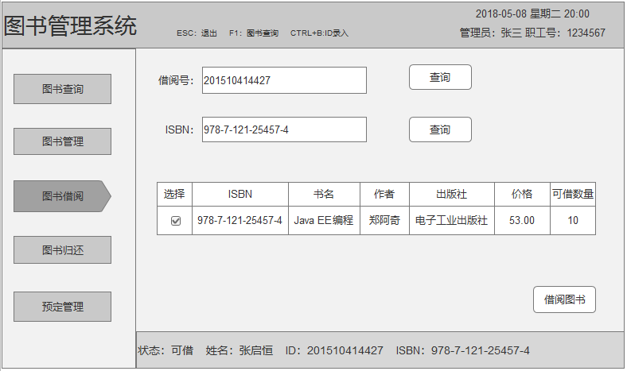

# 实验五：图书管理系统数据库设计与界面设计
|学号|班级|姓名|照片|
|:-------:|:-------------: | :----------:|:---:|
|201510414427|软件(本)15-4|张启恒||

## 1.数据库表设计

### 1.1 管理员信息（Manager）表：
|项目|字段名|类型与宽度|主键、外键|是否允许为空值|约束|说明|
|:------:|:-------:|:-------:|:-------:|:-------:|:-------:|:-------:|
|ID|managerId|int(12)|主键|×|||
|管理员名|name|varchar(20)||×|||
|密码|password|varchar(20)||×|||
|职位|role|bit||×||1：系统管理员，0：图书管理员|
|电话|tel|int(11)||×||联系电话|
|照片|photo|varbinary(MAX)||√|||

### 1.2 读者信息（Reader）表：
|项目|字段名|类型与宽度|主键、外键|是否允许为空值|约束|说明|
|:------:|:-------:|:-------:|:-------:|:-------:|:-------:|:-------:|
|ID|readerId|int(12)|主键|×||学生ID为学号，老师ID为职工号|
|姓名|readerName|varchar(20)||×|||
|密码|password|varchar(20)||×||初始密码为ID|
|性别|sex|bit||×||1：男，0：女|
|出生日期|born|datetime||×|||
|职位|role|bit||×||1：老师，0：学生|
|所属学院|college|varchar(20)||×|||
|专业|spc|varchar(20)||√||老师可以不填|
|借书总数量|num|int(10)||×||初始默认为0|
|电话|tel|int(11)||×||联系电话|
|照片|photo|varbinary(MAX)||√|||

### 1.3 公告信息（announcement）表：
|项目|字段名|类型与宽度|主键、外键|是否允许为空值|约束|说明|
|:------:|:-------:|:-------:|:-------:|:-------:|:-------:|:-------:|
|ID|id|int(10)|主键|×||自增1|
|内容|content|varchar||×|||
|开始时间|startTime|datetime||×|||
|结束时间|endTime|datetime||×|||
|备注|note|varchar(20)||√|||

### 1.4 图书信息（Book）表：
|项目|字段名|类型与宽度|主键、外键|是否允许为空值|约束|说明|
|:------:|:-------:|:-------:|:-------:|:-------:|:-------:|:-------:|
|ISBN|ISBN|varchar(20)|主键|×|||
|书名|bookName|varchar(40)||×|||
|作者|author|varchar(10)||×|||
|出版社|publisher|varchar(20)||×|||
|价格|price|float||×|||
|馆藏数量|totalNum|int||×|||
|可借数量|num|int||×|||
|借出总次数|lendNum|int||×||借出一次+1|
|内容简介|summary|varchar(60)||√|||
|封面图片|photo|varbinary(MAX)||√|||

### 1.5 借书记录（BorrowRecord）表：
|项目|字段名|类型与宽度|主键、外键|是否允许为空值|约束|说明|
|:------:|:-------:|:-------:|:-------:|:-------:|:-------:|:-------:|
|ID|id|int|主键|×||自增1|
|借书流水号|borrowRecordId|varchar(40)||×||流水号为：借书标志+借书时间+ISBN+读者Id|
|ISBN|ISBN|varchar(20)|外键|×|Book.ISBN|外键索引|
|读者ID|readerId|int(12)|外键|×|Reader.readerId|外键索引|
|书名|bookName|varchar(40)||×|||
|借书时间|lendTime|datetime||×|||
|是否归还|isReturn|bit||×||1：已还，0：未还，默认为0|
|时长|length|int||×||默认时间30天，超过30天则逾期|
|还书日期|returnTime|datetime||√|||
|是否续借|isRenew|bit||×||1：是，0：否，默认为0|
|是否逾期|isOverdue|bit||×||1：是，0：否，默认为0|
|逾期时长|overdueTime|int||×||以天数为单位，默认为0|

### 1.6 预定记录（OrderRecord）表：
|项目|字段名|类型与宽度|主键、外键|是否允许为空值|约束|说明|
|:------:|:-------:|:-------:|:-------:|:-------:|:-------:|:-------:|
|ID|id|int|主键|×||自增1|
|预定流水号|orderId|varchar(40)||×||流水号号为：预定标志+预定时间+ISBN+读者Id|
|ISBN|ISBN|varchar(20)|外键|×|Book.ISBN|外键索引|
|读者Id|readerId|int(12)|外键|×|Reader.readerId|外键索引|
|预定时间|orderTime|datetime||×|||
|时长|length|int||×||默认为7天，超过7天为处理，自动取消预定|
|是否取消|isCancel|bit||×||1:是，0：否|

### 1.7 图书操作日志（BookLog）表：
|项目|字段名|类型与宽度|主键、外键|是否允许为空值|说明|
|:------:|:-------:|:-------:|:-------:|:-------:|:-------:|
|ID|id|int|主键|×|自增1|
|动作|action|varchar(20)||×|save：增加图书、update：修改图书、delete：修改图书|
|细节|detail|varchar(255)||×|包含图书（Book）所有信息|
|创建时间|createTime|datetime||×||
|实体ID|entityId|int(10)||×||
|实体名称|entityName|varchar(255)||×||

### 1.8 馆藏书目（BookCollection）表：
|项目|字段名|类型与宽度|主键、外键|是否允许为空值|约束|说明|
|:------:|:-------:|:-------:|:-------:|:-------:|:-------:|:-------:|
|ID|id|int|主键|×||自增1|
|ISBN|bookName|varchar(20)||×|||
|书名|bookName|varchar(40)||×|||
|语言|language|varchar(20)||×||书籍语言|
|国家|countries|varchar(20)||×|||
|种类|kinds|varchar(20)||×||图书种类，如小说、文学、艺术等|
|种类细分|kindsDetail|varchar(40)||×||种类细分，如古典小说、现在小说、武侠小说等|
|其它|other|varchar(40)||×|||

### 1.9 逾期记录（OverdueRecorder）表：
|项目|字段名|类型与宽度|主键、外键|是否允许为空值|约束|说明|
|:------:|:-------:|:-------:|:-------:|:-------:|:-------:|:-------:|
|ID|id|int|主键|×||自增1|
|逾期流水号|overdueId|varchar(40)||×||流水号号为：逾期标志+逾期时间+ISBN+读者Id|
|ISBN|ISBN|varchar(20)|外键|×|Book.ISBN|外键索引|
|读者Id|readerId|int(12)|外键|×|Reader.readerId|外键索引|
|书名|bookName|varchar(40)||×|||
|逾期时间|orderTime|datetime||×|||
|还书日期|returnTime|datetime||×|||
|逾期时长|overdueTime|int||×||以天数为单位，默认为0|
|备注|note|varchar||√|||

## 2.界面设计

### 2.1 图书借阅界面设计

- 用例图参考：借书用例
- 类图参考：Reader类、Book类、BorrowRecord类
- 顺序图参考：借书顺序图
  
### 2.2API接口如下：

1.getReader 接口 
  - 功能：根据借阅号获取读者信息，后台验证信息是否可借书
  - 请求地址：http//localhost/v1/api/getReader
  - 请求方法：post
  - 请求参数

    |参数名称|必填|说明|
    |:--:|:--:|:--:|
    |readerId|是|根据读者ID验证读者信息|

  - 返回实例：
     <pre>
    {
        "status": true
        "reader":
                  {"readerId": "201510414427",
                  "readerName": "张启恒",
                  "role":"0",
                  "sex": "1",
                  "born": "1996-01-17",
                  "college": "信息科学与工程学院",
                  "spc": "软件工程"
                  }
    }
    </pre>
  - 返回参数说明：

    |参数名称|说明|
    |:--:|:--:|
    |status|true：表示有该读者，可以借书；false：表示没有则不能借书|
    |reader|读者信息数组|
    |readerId|读者ID|
    |readerName|读者姓名|
    |role|角色：1：老师、0：学生|
    |sex|1:男、0：女|
    |born|出生日期|
    |college|所属学院|
    |spc|专业|

   2.getBook 接口
   - 功能：根据ISBN获取图书信息，后台验证信息是否可借书
   - 请求地址：http//localhost/v1/api/getBook
   - 请求方法：post
   - 请求参数

     |参数名称|必填|说明|
     |:--:|:--:|:--:|
     |ISBN|是|根据ISBN获取图书信息|

   - 返回实例：
    <pre>
       {
           "status": true
           "book":{
                   "ISBN": "978-7-121-25457-4",
                   "bookName": "Java EE 编程",
                    "author":"郑阿奇",
                    "publisher": "电子工业出版社",
                    "price": "53.00",
                    "num": "10"
                  }
       }
     </pre>

  - 返回参数说明

    |参数名称|说明|
    |:--:|:--:|
    |status|true：表示返回图书成功，可以借书；false：表示没有则不能借书|
    |book|返回的图书信息|
    |ISBN|出版物代码|
    |bookName|书名|
    |author|作者|
    |publisher|出版社|
    |price|价格|
    |num|可借数量|

  3.borrowBook 接口
  - 功能：实现借书API，将信息添加到数据库表中
  - 请求地址：http//localhost/v1/api/borrowBook
  - 请求方法：post
  - 请求参数

    |参数名称|必填|说明|
    |:--:|:--:|:--:|
    |readerId|是|借阅者ID|
    |ISBN|是|图书ISBN|

  - 返回实例：

    <pre>
        {
            "status": 1
        }
    </pre>

  - 返回参数说明

    |参数名称|说明|
    |:--:|:--:|
    |status|获取执行结果，为1时表示操作成功，为0时表示操作失败|
