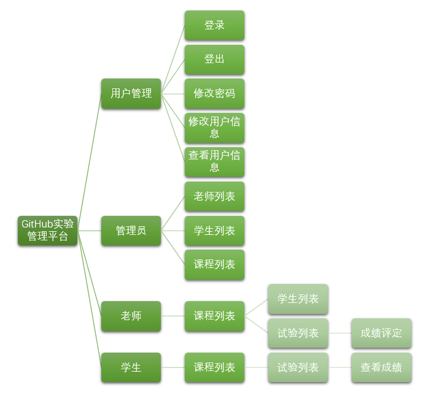
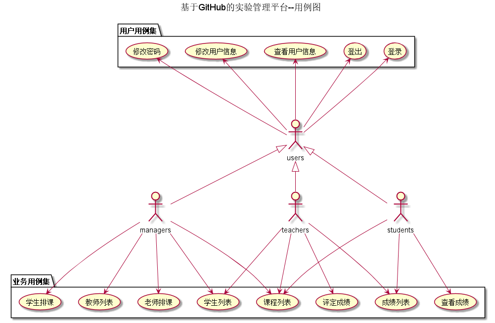
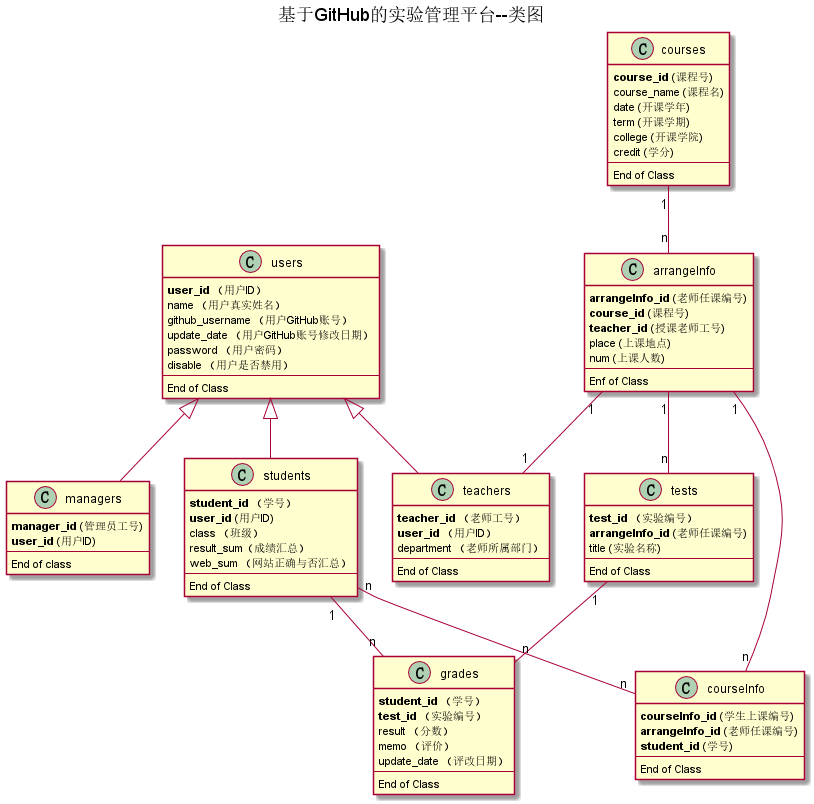

# 实验六：基于GitHub的实验管理平台的分析与设计
### 成都大学信息科学与工程学院
|学号|班级|姓名|照片|
|:-------:|:-------------: | :----------:|:---:|
|201510414427|软件(本)15-4|张启恒||

## 1.概述
- 基于GitHub的实验管理平台的作用是在线管理实验成绩的Web应用系统。
- 管理员的主要功能有：1、信息录入；2、给老师排课；3、给学生排课。
- 老师的功能主要有：1、根据自己教授的课程在GitHub上发布实验内容并指定GItHub库；2、批改学生的实验成绩；3、查看学生的实验成绩；4、设置自己的信息。
- 学生的功能主要有：1、设置自己的用户信息（GItHub账号、密码等）；2、根据所上的课程查看老师在GItHUb上发布的试验内容；3、根据实验内容提交试验（每门课程GitHub库不一样）；4、查询自己的实验成绩。
- 老师和学生都能通过本系统的链接方便地跳转到学生的每个GitHUB实验目录，以便批改实验或者查看实验情况。
- 实验成绩按数字分数计算，每项实验的满分为100分，最低为0分。
- 系统自动计算每个学生的所有实验的平均分。

## 2.系统总体设计

 
界面设计：https://zhangqiheng.github.io/is_analysis/test6/ui/index.html

   
## 3.用例图设计 [源码](src/UseCase.puml)

   
## 4.类图设计 [源码](src/Class.puml)

   
## 5.数据库设计
- ### [参见数据库设计](数据库设计/sql.md)

## 6.用例及界面详细设计

- ### [“登录”用例](用例/登录.md)，    [界面](https://zhangqiheng.github.io/is_analysis/test6/ui/登录.html)

