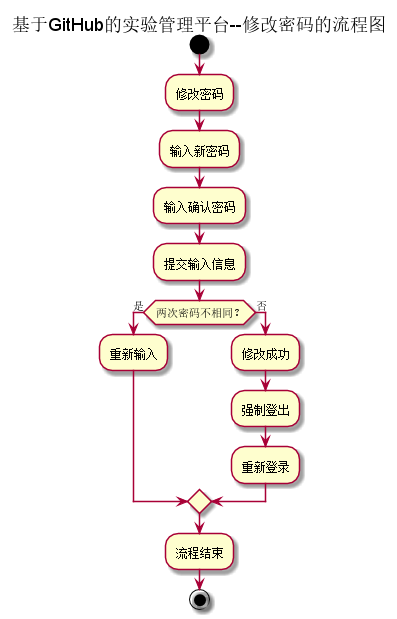
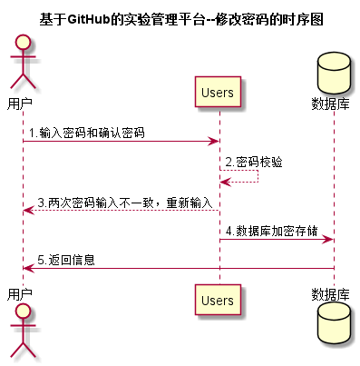

# “修改密码”用例 [返回](../README.md)
## 1. 用例规约

|用例名称|修改密码|
|:--|:--|
|功能|用户修改自己的密码|
|参与者|学生，老师，管理员|
|前置条件|必须先登录|
|后置条件|修改密码以后必须强制登出，再跳转到登录页面|
|主事件流| 1.用户填写新密码和确认密码   2.提交修改信息  3.系统存储修改后密码|
|备选事件流|1a. 用户两次输入的密码不同  &nbsp;&nbsp; 1.系统提示两次输入的密码不相同   &nbsp;&nbsp; 2. 用户重新填写并提交。 |

## 2. 业务流程[源码](../流程图/修改密码.puml)

## 3. 界面设计
- 界面参照: https://zhangqiheng.github.io/is_analysis/test6/ui/顶部菜单.html
- API接口调用
    - 接口1：[setPassword](../接口/setPassword.md)

## 4. 时序图 [源码](../时序图/修改密码.puml)

## 5. 参照表

- [Users](../数据库设计/sql.md/#Users)
