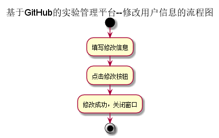
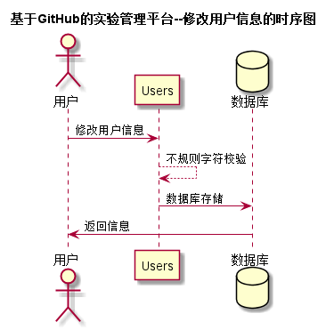

# “修改用户信息”用例 [返回](../README.md)

## 1. 用例规约

|用例名称|修改用户信息|
|:--|:--|
|功能|修改用户的GitHub用户名称|
|参与者|学生，老师，管理员|
|前置条件|必须先登录，并且查看用户现有的GitHub用户名|
|后置条件| 修改成功并存储用户信息|
|主事件流| 1.用户填写GitHub用户名称   2.用户提交修改信息  3.系统存储修改后的GitHub用户名称|
|备选事件流|1a. 如果用户输入的GitHub用户名称为空  &nbsp;&nbsp; 1.系统清空用户的GitHub用户名称|

## 2. 业务流程 [源码](../流程图/修改用户信息.puml)

## 3. 界面设计
- 界面参照: https://zhangqiheng.github.io/is_analysis/test6/ui/顶部菜单.html
- API接口调用
    - 接口1：[getUserInfo](../接口/getUserInfo.md)
    - 接口2：[setUserInfo](../接口/setUserInfo.md)

## 4. 时序图[源码](../时序图/修改用户信息.puml)

## 5. 参照表
- [Users](../数据库设计/sql.md/#Users)