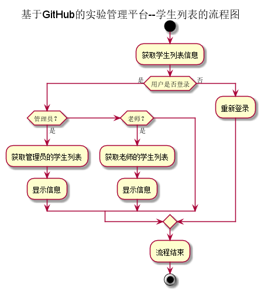
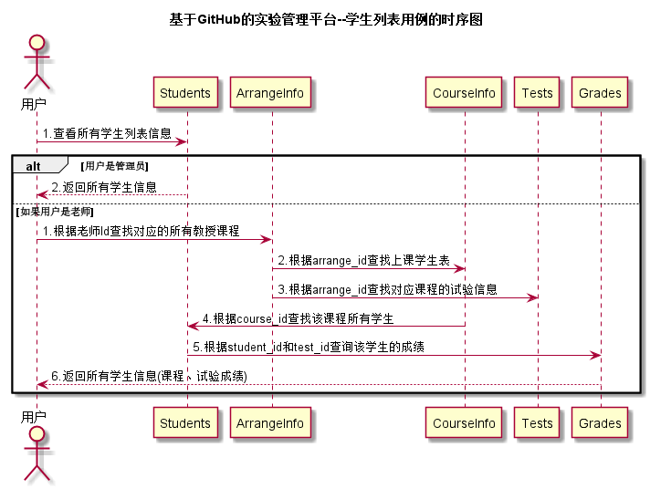

# “学生列表”用例 [返回](../README.md)
## 1. 用例规约

|用例名称|学生列表|
|:--|:--|
|功能|以表形式的显示出学生的信息|
|参与者|管理员，老师|
|前置条件|用户需要先登录|
|后置条件| 根据不同角色显示不同内容|
|主事件流| |
|备选事件流| |

## 2. 业务流程 [源码](../流程图/学生列表.puml)

## 3. 界面设计
- 管理员学生列表界面: https://zhangqiheng.github.io/is_analysis/test6/ui/管理员的学生列表.html
- 老师的学生列表界面: https://zhangqiheng.github.io/is_analysis/test6/ui/老师的学生列表.html
- API接口调用
    - 接口：[getStudents](../接口/getStudents.md)

## 4. 时序图[源码](../时序图/学生列表.puml)

## 5. 算法描述

- WEB_SUM解析为列表
  - WEB_SUM是接口getStudents的返回值中的一部分，形如："WEB_SUM": "Y,Y,Y,Y,Y,N"。需要在前端进行解析。
  - 作用是判断GitHub网址是否正确，用逗号分开，Y代表正确，N代表不正确。
  - 第1位代表总的GitHUB地址是否正确，第2位表示第1次实验的地址，第3位表示第2位实验地址，依此类推。
  - 比如：“Y,Y,Y,Y,Y,N”表示第5次实验地址不正确，其他地址正确。
  - 算法是使用使用字符串分离方法将其分开。

- RESULT_SUM解析为列表
    - RESULT_SUM是接口getStudents的返回值中的一部分，形如："RESULT_SUM": "81.25,70,80,85,90,N"。需要在前端进行解析。
    - 成绩汇总（来自GRADES表），以逗号分开，第一个成绩是平均成绩,后面是每次实验的成绩，N表示未批改，平均分只计算已批改的。
    - 比如：“81.25,70,80,85,90,N”表示一共批改了4次，第5次未批改，4次的成绩分别是81.25,70,80,85,90,N，4次的平均分是81.25
    - 算法是使用使用字符串分离方法将其分开。

## 6. 参照表

- [Students](../数据库设计/sql.md/#Students)
- [Grades](../数据库设计/sql.md/#Grades)
- [Tests](../数据库设计/sql.md/#Tests)
- [ArrangeInfo](../数据库设计/sql.md/#ArrangeInfo)
- [CourseInfo](../数据库设计/sql.md/#CourseInfo)
