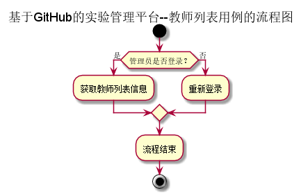
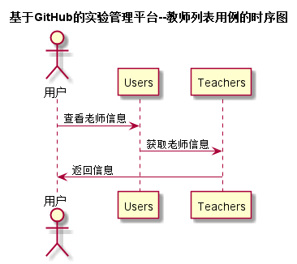

# “教师列表”用例 [返回](../README.md)
## 1. 用例规约

|用例名称|教师列表|
|:--|:--|
|功能|以表形式的显示出老师的信息|
|参与者|管理员|
|前置条件|用户需要先登录|
|后置条件| 显示老师列表信息|
|主事件流| |
|备选事件流| |

## 2. 业务流程 [源码](../流程图/教师列表.puml)

## 3. 界面设计
- 界面: https://zhangqiheng.github.io/is_analysis/test6/ui/教师列表.html
- API接口调用
    - 接口：[getTeachers](../接口/getTeachers.md)

## 4. 时序图[源码](../时序图/教师列表.puml)

## 5. 参照表

- [Users](../数据库设计/sql.md/#Users)
- [Teachers](../数据库设计/sql.md/#Teachers)
