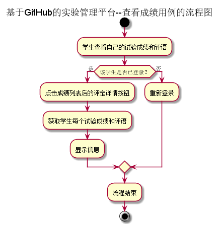
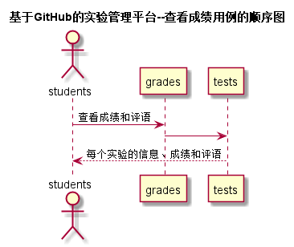

# “查看成绩”用例 [返回](../README.md)
## 1. 用例规约

|用例名称|查看成绩|
|:--|:--|
|功能|学生查看自己的每个实验的实验成绩及实验评价|
|参与者|学生|
|前置条件|学生需要先登录|
|后置条件| |
|主事件流| |
|备选事件流| |

## 2. 业务流程[源码](../流程图/查看成绩.puml)

## 3. 界面设计
- 界面参照: https://zhangqiheng.github.io/is_analysis/test6/ui/实验成绩详情页面.html
- API接口调用
    - 接口1：[getOneStudentResults](../接口/getOneStudentResults.md)

## 4. 时序图[源码](../时序图/查看成绩.puml)

## 5. 参照表
- [Students](../数据库设计/sql.md/#Students)
- [Grades](../数据库设计/sql.md/#Grades)
- [Tests](../数据库设计/sql.md/#Tests)