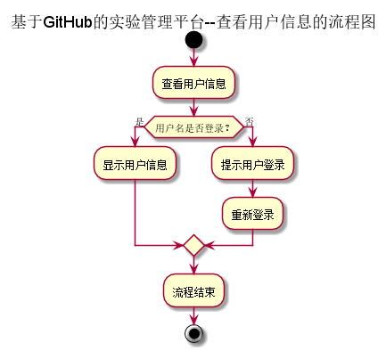
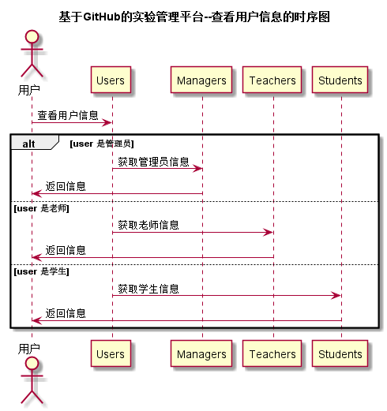

# “查看用户信息”用例 [返回](../README.md)

## 1. 用例规约

|用例名称|查看用户信息|
|:-------|:-------------|
|功能|查看用户的基本信息|
|参与者|学生、老师、管理员|
|前置条件|已经登录了试验管理平台|
|后置条件|点击顶部菜单的用户信息按钮，弹出用户信息框|
|主事件流| |
|备选事件流| |

## 2. 业务流程  [源码](../流程图/查看用户信息.puml)

## 3. 界面设计
- 界面参照: https://zhangqiheng.github.io/is_analysis/test6/ui/顶部菜单.html
- API接口调用
    - 接口：[getUserInfo](../接口/getUserInfo.md)

## 4. 时序图 [源码](../时序图/查看用户信息.puml)

## 5. 参照表

- [Users](../数据库设计/sql.md/#Users)
- [Managers](../数据库设计/sql.md/#Managers)
- [Teachers](../数据库设计/sql.md/#Teachers)
- [Students](../数据库设计/sql.md/#Students)