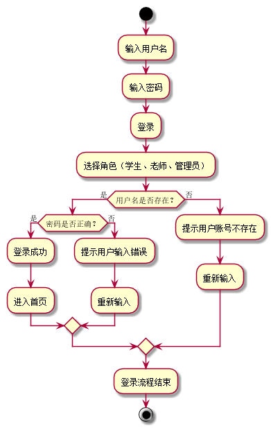
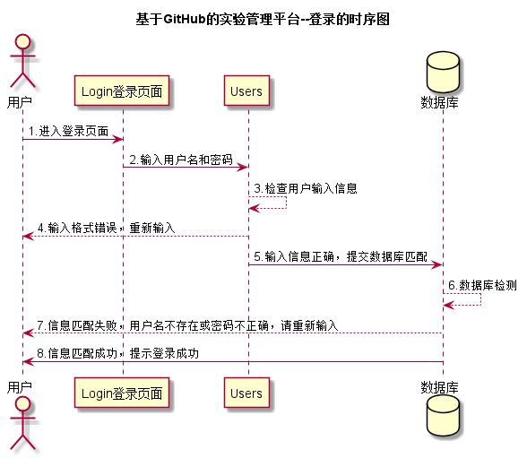

# “登录”用例 [返回](../README.md)

## 1. 用例规约

|用例名称|登录|
|-------|:-------------|
|功能|登录GItHub在线实验管理平台|
|参与者|学生、老师、管理员|
|前置条件| 数据库中有对应的用户信息|
|后置条件|登录成功后，跳转到角色对应的主页|
|主事件流| 1. 参与者输入用户名和密码，选择用户类型 2.系统判断用户名，密码，用户类正确，允许登录 3.系统在客户端以Cookie形式存储登录用户信息，保持登录的持久性。|
|备选事件流|1a. 输入的用户名或者密码为空  &nbsp;&nbsp; 1.提示用户重新输入   &nbsp;&nbsp; 2.参与者重新提交登录信息  2a.系统判断用户名，密码，用户类不正确，不允许登录  &nbsp;&nbsp; 1.提示重新输入   &nbsp;&nbsp; 2.参与者重新提交登录信息 |

## 2. 业务流程  [源码](../流程图/登录.puml)

## 3. 界面设计
- 界面参照: https://zhangqiheng.github.io/is_analysis/test6/ui/登录.html
- API接口调用
    - 接口：[login](../接口/login.md)

## 4. 时序图 [源码](../src/登录认证流程图.puml)

## 5. 参照表

- [Users](../数据库设计/sql.md/#Users)
