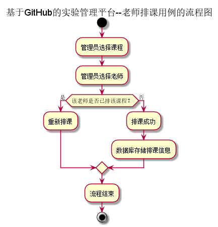
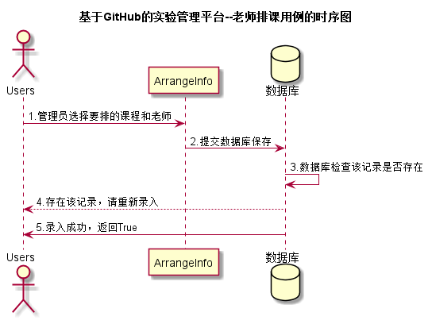

# “老师排课”用例 [返回](../README.md)
## 1. 用例规约

|用例名称|老师排课|
|:--|:--|
|功能|以弹框的效果显示新增排课页面，管理员为老师排课|
|参与者|管理员|
|前置条件|用户需要先登录|
|后置条件| 排课成功|
|主事件流| 1.管理员登录系统平台；2.进入老师排课页面；3.排课成功，系统数据库存储信息|
|备选事件流| 3a.该老师已经排了该课程  &nbsp;&nbsp;1.提示管理员重新排课|

## 2. 业务流程 [源码](../流程图/老师排课.puml)

## 3. 界面设计
- 界面: https://zhangqiheng.github.io/is_analysis/test6/ui/老师排课.html
- API接口调用
    - 接口1：[getTeachers](../接口/getTeachers.md)
    - 接口2：[getCourses](../接口/getCourses.md)
    - 接口3：[addArrangeInfo](../接口/addArrangeInfo.md)

## 4. 时序图[源码](../时序图/老师排课.puml)

## 5. 参照表

- [Courses](../数据库设计/sql.md/#Courses)
- [Teachers](../数据库设计/sql.md/#Teachers)
- [ArrangeInfo](../数据库设计/sql.md/#ArrangeInfo)
