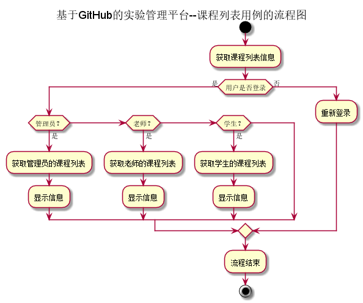
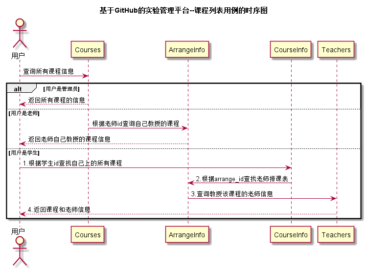

# “课程列表”用例 [返回](../README.md)
## 1. 用例规约

|用例名称|课程列表|
|:--|:--|
|功能|以表形式的显示出课程的信息|
|参与者|管理员、老师、学生|
|前置条件|用户需要先登录|
|后置条件| 显示课程列表信息|
|主事件流| |
|备选事件流| |

## 2. 业务流程 [源码](../流程图/课程列表.puml)

## 3. 界面设计
- 管理员和老师的界面: https://zhangqiheng.github.io/is_analysis/test6/ui/课程列表.html
- 学生的课程列表界面: https://zhangqiheng.github.io/is_analysis/test6/ui/学生的课程列表.html
- API接口调用
    - 接口：[getCourses](../接口/getCourses.md)

## 4. 时序图[源码](../时序图/课程列表.puml)

## 5. 参照表

- [Courses](../数据库设计/sql.md/#Courses)
- [ArrangeInfo](../数据库设计/sql.md/#ArrangeInfo)
- [CourseInfo](../数据库设计/sql.md/#CourseInfo)
- [Teachers](../数据库设计/sql.md/#Teachers)